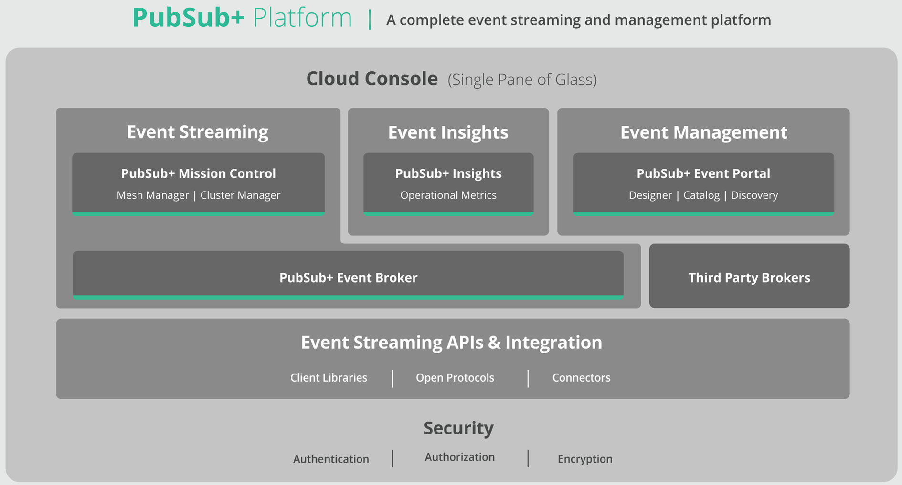

CDXP  (includes use of Solace)  vs GCInterop

#CDXP

- [Solace Docs - PubSub+ Cloud](https://docs.solace.com/): A complete event streaming and management platform for the real-time enterprise. The PubSub+ Platform helps enterprises design, deploy, and manage event-driven architectures (EDAs) across hybrid cloud, multi-cloud, and IoT environments, so they can be more integrated and event-driven.

## Solace PubSub+ Cloud Platform

Main Features:
- Cloud Console: "single pane of glass" deploy, link brokers. Monitor and performance of event mesh.  Define, manage and govern events.
  1. Event Streaming: Event broker services and features.  Engineered for security, resiliency and cost-optimization.  Manage event broker services in the cloud and on-premise.
  1. Event Insights: Curated dashboards, visualizations (historical and real-time)
  1. Event Management: create, design, share, and manage your events (PubSub+ event brokers or a Kafka event broker).  Runtime __discovery__ and __catalogoging__ of events, schemas and application interactions.   Generate code, documentation, validate events, and apply API management policies for applications in your EDA (event driven architecture)

- Event Broker : power an event mesh (a messaging layer that can be deployed across every environment and component of the distributed enterprise)
  1. Software: easy to deploy in clouds, containers, iPaaS/PaaS environments
  1. Appliance: extreme performance and capacity in a compact form factor
  1. Cloud: managed service

- Third-Party Brokers:  Runtime discovery agent to scan event streams from:
  - Apache Kafka
  - other Kafka distributions (from Confluent and Amazon MSK)

- Streaming APIs and Integrations: A variety of on-ramp / off-ramps to the mesh.   
  - for open standard protocols and APIs (MQTT, AMQP, JMS, REST)
  - proprietary messaging APIs, edge streaming application technologies, (StreamSets, Striim, Adaptris, ASAPIO, Dell Boomi)

- Security: see [Solace Security](https://docs.solace.com/Security/Security-Solace.htm)
