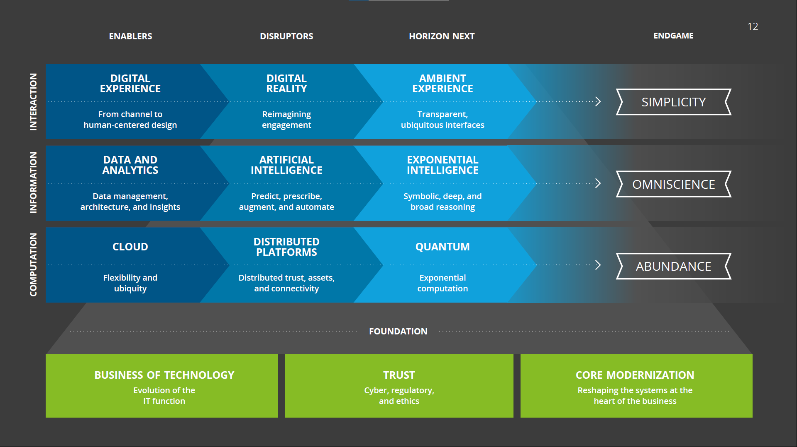

To Read
O'Reilly Learning Path: Software Architecture Fundamentals—Architectural Thinking (2hrs)
https://learning.oreilly.com/learning-paths/learning-path-software/0636920342458/

Clean Architecture: A Craftsman's Guide to Software Structure and Design, First Edition
https://learning.oreilly.com/library/view/clean-architecture-a/9780134494272/
Robert C. Martin  (Clean Code Author)

The goal of software architecture is to minimize the human resources required to build and maintain the required system.[ref: Clean Architectures]

Modes / Dev Methodologies
- test-driven development (TDD)

Phrases
- cleanliness of the
- the structure of the design
- good, clean, well-designed code matters,

- Software was invented to be “soft.” It was intended to be a way to easily change the behavior of machines. If we’d wanted the behavior of machines to be hard to change, we would have called it hardware. [ref: Clean Architecture]

- Testing shows the presence, not the absence, of bugs [ref: Dijkstra]

# Work Thoughts, Prinicples, Pillars, ETC

Evolutionary.  (ref https://learning.oreilly.com/library/view/mastering-api-architecture/9781492090625/ch01.html#idm46278377423928)

DevOps scorecard - google DORA

Open Source
- Open KM
- Orange HRM

# Layout of a Roadmap .

??? where does a roadmap fit in the vision, ... etc stuff???

- Strategy -> Action Plan (see https://www.nist.gov/system/files/documents/2019/02/06/2019-2020-baldrige-excellence-builder.pdf)

using oepn data as a source to copy - https://open.canada.ca/en/content/canadas-2018-2020-national-action-plan-open-government

- principles (inclusion, gender equity, accessibility, user centric thinking, reconciliation, collaboration, ..)
- see [tracker](https://search.open.canada.ca/en/nap/?_ga=2.171778336.1608214834.1628879429-147858638.1623275400) - [Search National Action Plan on Open Government Tracker](https://search.open.canada.ca/en/nap/?_ga=2.171778336.1608214834.1628879429-147858638.1623275400)
- see [IM Strate Plan](https://www.canada.ca/en/government/system/digital-government/digital-government-innovations/information-management/tbs-information-management-strategic-plan.html)
  - Roadmap, Strategic Direction, Guiding Principles, Vision, Mission, Strategic Goals and Objectives

# Technology trends
Doug Nielsen, "automation doesn't reduce the number of jobs, no more than LEDs save electricity, or, laundry machines freed our weekends...; like goldfish humans expand to their environment."

## Deloitte
[OneDrive - Deloitte Tech Trends](https://1drv.ms/u/s!AkwXSmFk-_xpgoZVgXXfOuIBHkkeuA?e=EL7Kt8)

## 2021 Trends
1. Digital Experience
1. Digital Reality
1. Ambient Experience
1. Data and Analytics
1. Artificial Intelligence
1. Exponential Intelligence
1. Cloud
1. Distributed Platforms
1. Quantum

|Layer|Enables|Disruptors|Horizon Next|End Game|
|--|--|--|--|--|
|__Interaction__|Digital Experience|Digital Reality|Ambient Experience|*Simplicity*|
|__Information__|Data and Analytics|Artificial Intelligence|Exponential Intelligence|*Omniscience*|
|__Computation__|Cloud|Distributed Platforms|Quantum|*Abundance*|
|||__Foundation__|||
|__Business of Technology__ - Evolution of the IT function||__Trust__ - Cyber, Regulatory, Ethics||__Core Modernization__ - Reshaping the systems at the heart of the business|

## 2018 Trends
[Deloitte 2018 Trends](https://documents.deloitte.com/insights/TechTrends2018)
- Reegineering Technology - build new IT delivery models from the top-down and bottom-up (automation, shared-skiled domain architects, ...).
- No-collar workforce - technology and machines work closer together for improved decision making and automation (RPA)
- Enterprise data sovereignty - data architecture and data governance to make information accessible, understandable and actionable across business lines
- The new core - extend the digital transformation to the back-end/back-office. Automation (RPA) and insights for finance and supply chain.
- Digital reality - Use AR and VR in business.
- Blockchain to blockchain - more applications in the blockchain ecosystem.
- API imperative
- Exponential technology watch

# GC
[DOSP](https://www.canada.ca/en/government/system/digital-government/government-canada-digital-operations-strategic-plans/digital-operations-strategic-plan-2021-2024.html)
 - [Digital Standards](https://www.canada.ca/en/government/system/digital-government/government-canada-digital-standards.html)
 - [Policy on Service and Digital](https://www.tbs-sct.gc.ca/pol/doc-eng.aspx?id=32603)
 - [Directive on Service and Digital](https://www.tbs-sct.gc.ca/pol/doc-eng.aspx?id=32603)
- [Data Strategy Roadmap](https://www.canada.ca/en/privy-council/corporate/clerk/publications/data-strategy.html)
- [Digital Services - A Report on Digital Services - 2018](https://www.tbs-sct.gc.ca/report-on-service/report-on-service/digital-services-en.html)
[National Plan on Open Government 2018-2020](https://open.canada.ca/en/content/canadas-2018-2020-national-action-plan-open-government)
- [Digital Services Tools](https://digital.canada.ca/tools-and-resources/)
- [TBS Information Strategic Plan 2016-2019](https://www.canada.ca/en/government/system/digital-government/digital-government-innovations/information-management/tbs-information-management-strategic-plan.html)

# Apps

- [ ] What is WebCIMS?  Mentioned as "improved IM integration within business processes through the use of GCDocs workflows to reduce the burden on users of TBS’s correspondence management system (WebCIMS)" in [IM Strategic Plan](https://www.canada.ca/en/government/system/digital-government/digital-government-innovations/information-management/tbs-information-management-strategic-plan.html#toc211) - Believe WebCIMS is this [WebCIMS](https://www.anetsolutions.com/solutions.html) & [BuyAndSell](https://buyandsell.gc.ca/procurement-data/tender-notice/PW-17-00782708) - [WorkDynamics ccmMercury](https://www.gsaadvantage.gov/ref_text/GS25F0197M/GS25F0197M_online.htm) - [ccmMercury](https://www.international.gc.ca/gac-amc/publications/atip-aiprp/assessments-evaluation/ccmMercury.aspx?lang=eng)
