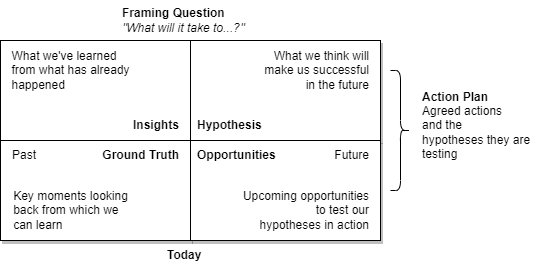

# Emergent Learning Map

EL Maps

## Emergent Learning

- Common structure and language for articulating learning question, sharing insights, framing and testing hypotheses.
- Makes patterns visible across groups, contexts, functions and geographies.
- Facilitates collective harvesting of lessons learned, as they emerge.
- Anchors a continuous action-reflection process.

Ground Truths

- In a changing world, there are no permanent “right answers”
- Current “best thinking” is better captured through hypotheses
- Knowledge is created while working
- “Lessons learned” are difficult to agree on, and even more difficult to share effectively.
- Knowledge left on the table at the end of the process is a wasted resource.

## Emergent Learning Maps 

- A blank canvas –multiple uses.
- Visual structure differentiates “past experience” from“future experience”, and “experience” from “thinking about experience”.
- Allows organisations in a network to think globally, act locally.
- Experience, insights and hypothesis are shared and collective -but actions can be independently decided.
- Allows more confident attribution of collective impacts.
- Consciously captures learning after events.

A framework for sharing lessons:

- **Challenge**: The situation/challenge we faced was (describe what led to the decision to learn together).
- **Framing Question**: Therefore, the framing question we asked was...
- **Learned**: What we have learnt so far is (describe key insights from successes and failures).
- **Hypothesis**: Based on this, our current hypothesis on what it will take to succeed is …..
- **Opportunities**: Opportunities to apply and test this hypothesis are (describe situations to which the hypotheses might apply).
- **Future Plans**: Our own plans to further test and refine this hypothesis are (describe actions agreed to by the group).

### Insight

- Reflections on “ground truths”.
- What have we already learnt about what works and what doesn't work?
- How has the ground situation changed over time –is there a pattern?
- Who are the key people/institutions who are acting as gatekeepers?
- What/where is our power to make change happen? How has it changed over time?
- Who can be our allies?

### Ground  Truth

- List the key defining features at present with respect to the learning question.
- Collective past experience of the group needs to be shared and collated to get a complete 3-D picture of reality.

### Hypotheses

- If we do (---------), then (-------) is most like to change in (----) way.
- This change is most likely to be stable over the long term if we do (---------).

### Opportunities

- What opportunities does the project give us to test our hypothesis

## Framing Question

- Guides, or leads, the learning process
- Should be positive, action-focused and forward-looking (not retrospective, analytical, negative).
- “What will it take to.....” or “What do we need to do to.....”
- “...sometimes the biggest “a-ha moment” in a learning process is the discovery that we have not been asking the right question!”

Example:

| Question                                                     | Suitability as Framing Question                |
| ------------------------------------------------------------ | ---------------------------------------------- |
| How can we get others to agree to our model                  | Poor.  Negative, analytical                    |
| What will it take to create the desired change?              | Average, lacks guidance                        |
| What will it take to create the desired change in a sustainable way? | Excellent, guides need for sustainable change. |

# References 

- [SoL Learning](https://www.solonline.org/)
- [Sol Reflections 8.1](https://www.solonline.org/wp-content/uploads/2018/08/sol_reflections_8.1.pdf)