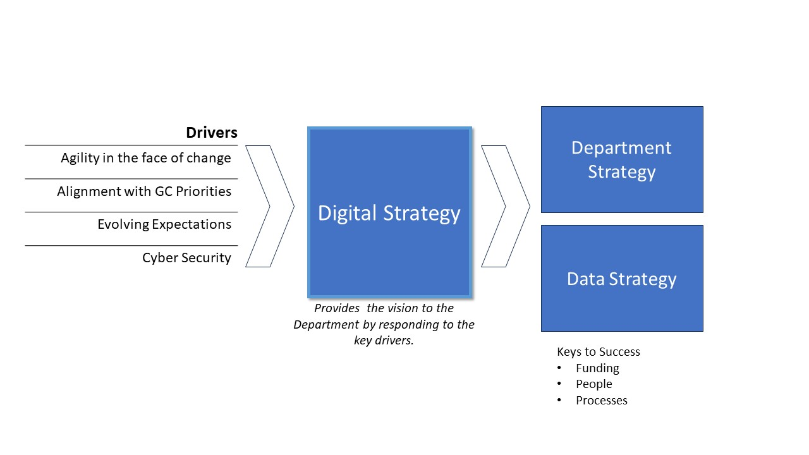
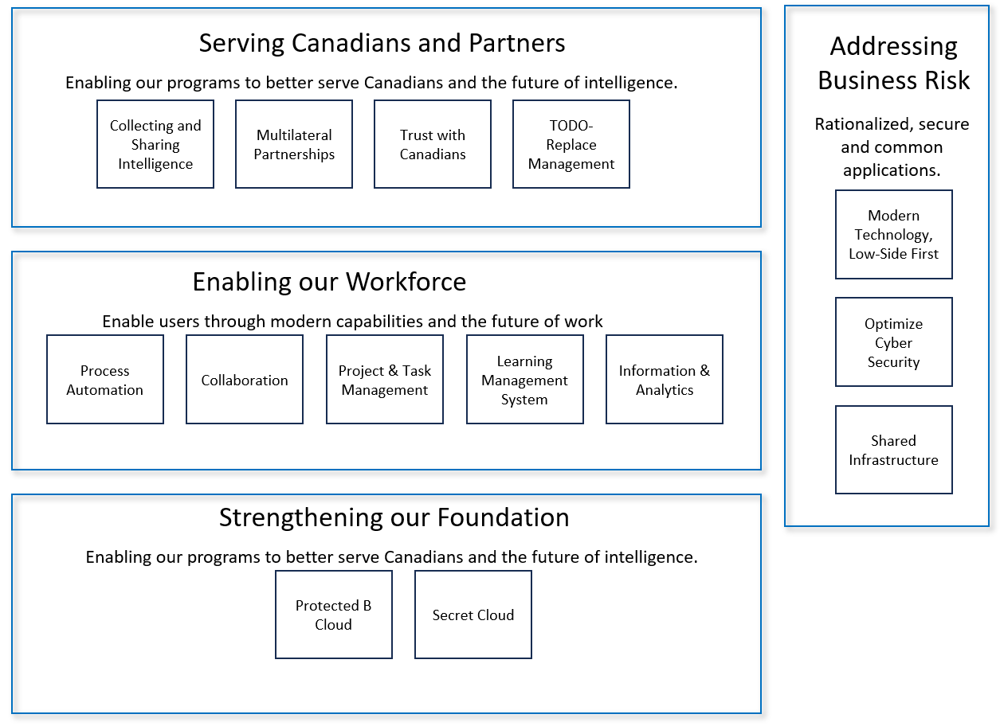

#  Public Safety Digital Strategy

# Executive Summary

Public Safety's digital strategy is the foundation for its modernization efforts.  A rapidly evolving technology and geopolitical landscape impacts the department's ability to fulfil its mandate.  The strategy ensures the organization can leverage new and emerging technology, enhance digital services and explore innovative opportunities.  The strategy provides a framework to address the challenges of disruptive technologies and global intelligence priorities.

The digital strategy underpins ACME's modernization efforts.  ACME is focused on upgrading its Information Technology systems in order to keep pace with the rapid evolving technology landscape in which it operates.

The objectives are: 

1. Digital Service: Delivering human centered digital services with modern digital experiences.
2. Digital Workforce: Providing our people with the knowledge, skills and competencies to work effectively in a digital environment.  Enable a digital culture through tools, skills and behavioural change.
3. Digital Workplace: Improving service delivery through simplified processes & technology.
4. Digital Foundation: Building a resilient secure technology infrastructure.

The digital strategy is expected to have significant impact on the business leading to several key outcomes.  

- Improved employee, partner and client experience
- New, digitally enabled services and products
- New business models (partner sharing, new information sources - OSINT partnerships, shared-services partnerships CSE, ...)

# Vision

The digital vision for TODO department is:

> Ensuring our systems, services and capabilities are relevant for the ~~current and future digital environment~~ dynamic digital world.

# Drivers

Public Safety operates in a complex global ever changing landscape.  Global stability is impacted by climate, economic and geopolitical instability.  The landscape is shifting faster than we are able to adapt.  This sentiment is well expressed by the director in May, 2022:

>  Geopolitical, economic, societal, environmental and technological changes are all converging to reshape the world around us at an accelerating pace. People everywhere, including in Canada, are contending with the human, social and economic impacts of these transformations. These trends are impacting our threat environment, and in turn, CSIS as an intelligence agency. — CSIS Director David Vigneault, [May 4, 2022 UBC](https://www.canada.ca/en/security-intelligence-service/news/2022/05/remarks-by-director-david-vigneault-to-the-university-of-british-columbia.html)

The rapid pace of technological innovation in areas like social media, artificial intelligence, and cryptocurrency is radically transforming society and government.  Social media has transformed the way people communicate, consume information and form opinions.  Social media is also used to impact democratic institutions and proliferate misinformation.  AI is used throughout industry; self-driving cars, trucks and taxis are disrupting transportation.  AI is also used deep fakes, cyber-attacks and ransomware campaigns.  Cryptocurrencies allow threat actors to raise funds anonymously.

In order to keep up with the fast-changing technological landscape, Public Safety must develop innovative strategies and processes that leverage digital technologies, including data analytics, automation, and cyber. This digital strategy is designed to adapt and respond to these changes.   The core drivers are:

1. Agility in the face of change
2. Alignment with the Government of Canada's Digital Priorities: 
3. Evolving Expectations
4. Cyber Security

**Agility in the face of change**: Global events such as cyber attacks, disinformation campaigns and changing geopolitical stage require an organization and technology that is more adaptive and responsive to change.  Leveraging new technologies, such as cloud computing, open-source intelligence and big data analytics, is needed to keep up with the pace of change.

**Alignment with the Government of Canada's Digital Priorities**: The GC Digital Ambition requires Public Safety to embrace a culture shift towards full digital delivery and to adopt a client-centric approach. This involves taking an agile, user-focused, and outcome-based approach to digital service delivery.

**Evolving Expectations**: Digital services, and the use of modern technologies, are raising the expectations of employees, Canadians and global partners. Meeting user expectations through digital services provides an advantage for the business and in hiring and retaining talented employees. Public Safety needs to keep pace with increasing digital expectations to be able to remain effective in the evolving threat environment.

**Cyber Security**: The emergence of new technologies has made cyber threat activity more sophisticated and challenging to defend against. To maintain the security of Public Safety's information and services, ongoing investment and attention are required. This includes modernizing existing capabilities and implementing new security controls, updating existing controls, and educating staff on the latest threats and best practices.

## Digital Strategy and Department Strategies

# Pillars

The drivers identify the need for a strategy.  The following pillars identify clear areas of focus required to address these challenges, and provide a foundation to help drive departmental strategies forward.  These four digital strategy pillars work together to create a cohesive and effective digital environment for the department. 

- **Digital service**: Public Safety Canada will provide effective digital services to employees, citizens and partners by modernizing its systems and using modern, emerging technology to support its operations.
- **Digital workforce**: Public Safety Canada will have a digital-savvy workforce that is equipped with the skills and resources to succeed in the digital age.
- **Digital workplace**: Public Safety Canada will create a digital workplace that is efficient, collaborative, and secure, where employees can thrive and be productive.
- **Digital foundation**: Public Safety Canada will have a reliable, secure, and adaptable technology infrastructure that enables the delivery of services and supports the department's digital transformation.

## Digital Services

The digital service pillar involves modernizing and transforming Public Safety digital services by partnering with the business to build people-centered digital services.  This includes dedicated resources to enable human-centric digital solutions, co-ordinated planning and development of digital investments, and adopting digital standards to innovate and iterate solutions.

## Digital Workforce

The digital workforce pillar fosters  a digital-savvy workforce that is equipped to use digital tools to advance the department's mission. Through training and upskilling initiatives, the pillar ensures that its employees have the necessary skills to leverage digital tools effectively. A digital culture that embraces innovation, encourages collaboration, and promotes continuous learning is a key component of this pillar.

## Digital Workplace

The digital workplace pillar is about creating an efficient, collaborative, and secure digital environment for employees to work in, leveraging automation and data-driven decision making.  This environment is optimized, to the extent possible, for secure, safe remote work, ensuring employees have the flexibility and resources they need to excel in their work.

## Digital Foundation

The foundation pillar provides a strong technical infrastructure to support the department's operations.The foundation ensures that the department has a secure, efficient, and up-to-date technology infrastructure capable of supporting its operations. This includes improving the department's ability to use open-source intelligence, modernizing its enterprise resource planning and human resource systems, and establishing a protected-B network to facilitate the secure sharing of information. By addressing these critical technology gaps, the department will be better positioned to meet its goals and deliver on its mission.

Each pillar provides guidance for department initiatives:

| **Digital Services**                                         | **Digital Workforce**                                        | **Digital Workplace**                                        | **Digital Foundation**                                       |
| ------------------------------------------------------------ | ------------------------------------------------------------ | ------------------------------------------------------------ | ------------------------------------------------------------ |
| Collaborate with the business to  provide effective digital services to employees, citizens and partner. | Foster a digital-savvy workforce  that is equipped with the skills and resources to succeed in the digital age. | Create a digital workplace that  is efficient, collaborative, and secure, where employees can thrive and be  productive. | Provide a reliable, secure, and  adaptable technology infrastructure that enables the delivery of services and  supports the department's digital transformation |
| Dedicate  resources to enable co-designed digital services   | Invest in digital and data competencies                      | Invest in OSINT strategies,  technologies and  skill development. | Modernize technology, low-side smart                         |
| Collaborate and partner with programmes  to plan and develop digital | Promote and communicate digital  adoption.                   | Provide tools to securely collaborate globally.              | Optimize Cyber Security                                      |
| Encourage prototyping to explore  possibilities.             | Engage digitally native champions  •Enable digital innovation by evolving  digital policy and governance | Automate                                                     | Leverage partnerships for solutions and  services.           |
| Iterate service improvement in all  digital solutions.       |                                                              | Improve decision making by leveraging  data  and analytics   |                                                              |

## Keys to Success

The digital strategy guides the digital transformation.  The success is dependent on enabling support for ambitious transformations.  The enabling support includes:

**Predictable investment in Digital**:  Change and transformation is a mulit-year initiatve.  Having predictable funding for multi-phased program delivery available for information management and information technology (IM/IT) and innovation is required.

**People First Mindset**: A people-first leadership mindset, with a culture value diverse, multi-disciplinary views is key.  Emotional leadership where employees are seen, heard and valued will help to attract the talent in cloud, AI and cyber security needed for success. Employees who feel connected and valued are more likely to be engaged and productive. 

**Digital and Data Literacy**: The transformation encompasses significant change.  For employees to feel empowered by the change, mature change management methodologies need to be embraced.  Change starts with engagement  and communication.  Additionally, employees, should be provided the opportunity to learn and practice safely new digital skills.

**IM/IT Operating Model**: The delivery of services needs to mature to include a partnership with the business.  Creating a multi-disciplinary team enables human-centric design and service delivery which is rapidly adopted.  A prioritization framework to make investments transparent to the enterprise is required.

# Portfolios

**NOTE:** 

>  The following section is a rough-draft.  Buy-in and collaboration on the major objective/action-plan within the pillars is an important first step before elaborating.  The following are some key bullet-points for each objective/action-plan that would typically be included in a DPSD (Departmental Plan on Service and Digital). 
>
>  **TODO**: ?? Are we going to have an accompanying DPSP with prioritized initiatives??

## Overview

The digital strategy proposes four (4) portfolios to align with department priorities and business outcomes.  The digital strategy represents a significant change.  The extent of change might be unmanageable if attempted all at once.  It is recommended to focus by prioritizing the initiatives.  The prioritized initiatives must be supported by the keys to success (funding, staffing and processes).

| **Digital Services**                   | **Digital Workforce**          | **Digital Workplace**         | **Digital Foundation** |
| -------------------------------------- | ------------------------------- | ----------------------------- | ---------------------- |
| Collecting and Sharing Intelligence    | Digital Skills Journey          | Business Process Automation   | Protected B Cloud      |
| Investment in Multilateral Partnership | Digital Native Change Champions | Collaboration                 | Secret Cloud           |
| Trust with Canadians                   |                                 | Project and Task Management   |                        |
|                                        |                                 | Learning Management System    |                        |
|                                        |                                 | Data, Information & Analytics |                        |
| ***TBD**: Business Direction Required |                                 |                               |                        |

## Portfolios

## Serving Canadians & Partners via Digital Services

The following initiatives help better serve our employees, our partners and clients throughout the intelligence cycle.

Collecting and Sharing Intelligence

- **TODO**: ?? which programs which identify the gap in the ability to collect or share intelligence ?? - Need business input.
- "Public Safety provides hundreds of briefings each year" ([reference](https://www.canada.ca/en/security-intelligence-service/corporate/collecting-and-sharing-intelligence.html)):  How are these managed?  Is there a need for a robust framework that captures the outcomes and business value of these briefings?
- [Democratic Institutions - Public Inquiry - Justice Hogue](https://www.canada.ca/en/democratic-institutions/news/2023/09/government-of-canada-launches-public-inquiry-into-foreign-interference.html):  Are there any digital gaps known or anticipated from the inquiry?  "...mandated to assess the capacity of federal entities to *<u>detect, deter and counter foreign interference</u>* targeting Canada’s democratic processes, and to make any recommendations she deems appropriate to better protect Canada’s democratic processes from foreign interference, including in relation to the creation and dissemination of intelligence, relevant supports and protections for members of diasporas, and the mechanisms that were in place to protect the integrity of 43rd and 44th elections."

Investment in Multilateral Partnerships: 

- Investment in 5EE, and the secure exchange of information and intelligence in a compliant, transparent manner.  5EE programs to digitize collaboration and intelligence sharing compliantly.  

Trust with Canadians

- Establish a compliance framework (OCFI) to ensure compliance with legislative and standards framework.

TODO-REPLACE Management

- Evolution of compliance management system to TODO-REPLACE
- Creation of TODO-REPLACE-EMS

## Enabling our Digital Workforce

Ensuring employees have the necessary training, skills and experience to succeed in the department's digital transformation is key to its success.  The department People Strategy includes aspects relating to an employee's journey throughout their career.  The digital strategy engages and ensures the journey includes the necessary opportunities for employees to acquire and maintain digital leadership skills.

Equally important is for employees to be empowered and trusted to make business impacts.  The digital strategy aims to evolve digital policy and governance with a focus on enablement.

- Digital Skills Journey: Engage with human resources to include digital skills competency building across all levels of leadership. Investing in our employees to increase digital literacy is a key success factor to eensure our peopel can fully realize the value of modern solutions.
- Digital Native Change Champions Network:  Create a structure for identifying and training digital change management champions.  Create a structure, leveraging collaboration technology, for these employees effectively support others.  Measure success by tracking adoption and satisfaction levels.  Provide rotational opportunities and iteratively improve across major transformational initiaitves.

## Enabling our Digital Workplace

### Business Process Automation

Leveraging existing investments in business process automation, including an assessment of low-code and no-code solutions to enable business-led automation compliant with the departments policy framework.

- Leverage existing investments in TODO-REPLACE and TODO-REPLACE to enable process optimization and delivery including the threat management and compliance systems.
- Explore existing business process automation investments to reveal opportunities to optimize, simplify and reduce duplication.
- Identify and pilot a citizen-developed low-code opportunity using existing accredited technology.

### Collaboration

Digital collaboration in a compliant manner helps the transformation to digital where information is managed promoting a compliant and transparent culture.

- Enterprise Content Management solution
- Employee Engagement Platform on both the high and low networks
- Learning Management System
- Low-Side Collaboration Platform: Assess collaboration needs beyond O365 and prioritize future phases of Protected B development.  Wikis and task management are commonly provided by other technology suites like MediaWiki, Atlassian Confluence and Jira.

### Project and Task Management

Providing ease-of-use digital tools for project and task management allows employees to be more efficient and effective in their work.  These tools also provide accountability and insights to allow for iterative continuous improvement of business processes.

- Deploy and Enterprise Project and Task Management solution for use by all employees in an secure and information management compliant manner.

### Learning Management System

An effective, modern learning management system is key to providing meaning, engaging learning for the department.

- Modernize high-side learning management system (LMS) identifying which training is required in the secure environment.

### Data, Information & Analytics

Empower employees to leverage the department's data and information respecting established policy and access management frameworks.

- Evolve Business Intelligence; consolidating on a rationalized, affordable, compliant, sustainable technology stack.
- Modernize and communicate self-serve application suite available to employees to manage large data sets.  

## Stengthening our Digital Foundation

This foundation pillar modernizes the departments technical infrastructure footprint.  

### Cloud Protected B 

Providing a secure cloud foundation is critical to the ongoing sustainability of department.  

- Establish Core Protected B capability
- Migrate HR business processes to cloud.

### Secret Cloud

The efficiency of migrating workloads to Protect B has not been assessed.  The data classifications of workloads and the accompanying mitigation measures might result in Protected B solutions be infeasible.  The need to investigate opportunities for a Secret Cloud offering and targeted applications is a strategic priority.

- Secret Cloud:  Identify applications suitable for Secret Cloud where the entire workload would feasibly be contained in the environment and not reliant on cross-domain-solutions and high-side mirror-applications.  As this option is in its nascent stages there are many options, and effective vendor and partner engagement is key to success.

# Addressing Business Risk

Alongside the pillars to drive the digital strategy is an overarching need to reduce technology ownership, improve cyber security and consolidate infrastructure ownership.  These activities aim to reduce the overall risk of the department.

### Modernize Technology, Low-Side First

Leverage and continue to invest in enterprise application portfolio management (APM) capabilities.  Use these insights provided by APM to prioritize projects to retire or migrate legacy applications.  Adopt a low-side smart mindset inspired by the GC Cloud First concept.  

- Cloud first is often called Cloud Smart recognizes that not all workloads need to be in the cloud, and that different applications and services have different needs. The goal of cloud smart is to optimize systems and processes for the best possible outcome, rather than blindly moving everything to the cloud regardless of the cost or benefits.  Low-side smart aims to identify the classification of the business workload, and, triage if it is suitable for more cost-efficient network like a PB network.

### Optimize Cyber Security

Ongoing investment and attention in cyber security is required as identified in a recent business case.  As the department moves more business process to lower security zones following the "low-side smart" guidance, increased capacity in cyber security is required to protect these investments.

- Cyber Security:  Investments in establishing the technology, workforce, policies to support key cyber cornerstones like monitoring, auditing and vulnerability testing.

### Shared Infrastructure

Consolidating responsibilities for infrastructure will optimize efficiencies within the department.  In 2023, the study identified several key initiatives.  

- Phase 1 of Shared Infrastructure Study

# Missing

These items, among others, might be useful inclusions in a digital strategy:

- DEI : no mention of diversity, equity and inclusivity
- mutli-disciplinary team: no mention of the value of including people "not like you" in the teams, agile develop to evoke challenging discussions, and, obtain different perspectives
- partnerships:  Missing 3rd party / OGD development of solutions which could leverage the DevOps pipeline.
- Prioritization framework:   Transparent culture and sharing or prioritizations (and aware of what investments are being made)
- ...

# Glossary

Technical Debt:  Technical debt occurs when a)refreshes are not not regularly conducted, b) institutional knowledge is not captured, c) interdependencies are not captures, and, d) if transformations do not keep pace with business and industry change velocity. — paraphrased from GC Digital Ambition