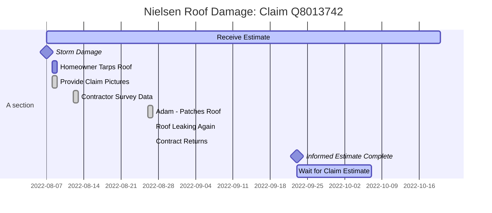

# Roof Damage in Storm - 2022 

# Preventative Bills - August

- tarps

# Contacts

- Natoya Personal Insurance 1-866-688-3888 ext 4519245
- Natoya Cole
  Claim Advisor – Claims
  P.O. Box 7065, Mississauga, Ontario L4Z 3Z9
  Phone : 1 866-688-3888 Ext. 4519245
  Fax : 905-306-4551
  [natoya.cole@dgig.ca](mailto:natoya.cole@dgig.ca)

# Details

Claim Number: Q8013742

## August 12: Survey Damage: First Contractor Visit

- Believe contractor came on August 12.  Shown interior damage in living room and bedrooms.  Informed of damage in garage, too. 
- Contractor informs us that an emergency work order will be raised to patch the roof temporarily.
- Roof is not patched for 14-days (August 12 to August 26)

## August 25: Requesting Update

- Email The Personal (Natoya) requesting an update.
- Receive call the next day from Natoya who left voicemail @ 9:38am Aug 25th 
- Waiting on Estimate from Contractor
- Once uploaded and approved will be in touch for next steps

## August 26: Contractor Patches Roof

- Adam: 1-705-978-2432  (9:47am)
- patches roof, takes photos, removes tarp and leaves tarp on yard
- other waste like caulking tubes are left on yard.

- Adam from cms - 9:47am August 26th

- patch and photos
- 7059782432

## September 9: Natoya - got my email

- reached out to contractor - Adam
- still water, reached out to roofing company to reach out to me
- 2:30pm September 6

## September 9: Roofer 613-294-4011

Harry Larsch - come back to see where leaking

Roofer First General 10:14 September 8

## October 12: 

## October 13: Call backed regarding email on status

First call said not until new year Dec/Jan of roof

Second call said spring April / May and to call to discuss options

## October 20: Calling Natoya...

Three options

1. wait for 1st general
2. find a contract
3. do work yourself

Process

1. Will send email with the scope.   Contractors didn't send, since they were busy.

1. They send authorization.  They won't start repairs until a later time.  So situation is different. 

1. What happens if there is subsequent damages through the winter.  Let The Personal know.  It should ... - that would be separate claim.  Emergency.  If there is water coming in, we can let you know.  Contact a moving company.

   - 3rd light bulb in hallway, call and let us know.   Send ou

   - t contractor.  If not able we must contact roofing to mitigate losses.  It is not a separate claim.

1. on Option 2; what is my scope.

1. Will exact analysis. 

1. Review email.   It goes over the areas, square footages and amounts and price.   

1. Make decision.  Go with First General.   I choose other, limited by $11,600 budget.

Apologize for dealy in scope being sent.

# Photos

- 
- 
- 
- https://photos.app.goo.gl/jfCZPXGqzExqDKbK6
- - used this [Embed Google Photos App](https://www.labnol.org/embed/google/photos/) after reading [this article](https://www.labnol.org/internet/embed-google-photos-in-website/29194/)
  - to get this: 
    - direct link: https://lh3.googleusercontent.com/nw7lwiVA0Id0hZ69-b5KzupNyaOVci7pdAQA5mrGyrK-j4b_RVq871WpWuL-dRmd4X8hP0YsoYMv3vaPKCvJQ-jfsCuaGStmbvgixRcHWOZeb_ItKRlc2j3MUUcuFprwxFBmwt5Bbto=w2400
      - with markdown 
    - embed link: 
    - How it works: 
    - When you share any single photo in Google Photos, it creates an unlisted link that is accessible to anyone including those who are not logged into their Google Accounts. Internally, the embed app downloads the page behind this link and extracts the Open Graph tags to determine the direct link of the image and the underlying photo album.
- 

## Dropbox

https://www.dropbox.com/s/9blijgrnfde2xf2/20220807_Roof-1.jpg?dl=0

- 
- 
- 

## What is the problem?

1. looking for a content host for website
1. offer an endpoint or way to embed content directly in webpages

### URL Addressable Content

objects in S3 are URL-addressable

- [Using S3 to store web Content](https://aws.amazon.com/blogs/aws/using_s3_to_sto/)
  - [AWS S3 Metadata](https://docs.aws.amazon.com/AmazonS3/latest/userguide/UsingMetadata.html) : Allows user-defined metadata

### Curiousity?

- How does Dropbox and Google Photos prevent the "URL" from being used as a content host?  Is this cross-site ?

- 

# Technology

- [TimelineJS](https://timeline.knightlab.com/)
- [hotlinking](https://www.hostinger.com/tutorials/hotlinking): Hotlinking is the act of using another site’s bandwidth by displaying their website asset – like an image, video, or audio file – on a different website via a direct web link.  When this happens, the original website owner must cover and pay for these server resources each time a web browser wants to load and view the asset.
  - [Prevent Hot Linking](https://www.blogginglove.com/prevent-image-hotlinking-but-allow-google/):  .htaccess file (allow Google Search Engine, but block others with RewriteRules)
- [Direct Link - inline linking](https://en.wikipedia.org/wiki/Inline_linking)

