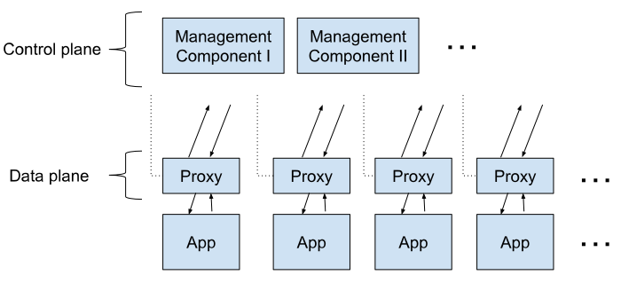

# Service Mesh

[Service Mesh Patther](https://philcalcado.com/2017/08/03/pattern_service_mesh.html)

## Service Mesh Features

Infrastructure layer which handles inter-service communication in a microservice architecture.
- decentralized
- self-organizing networks between microservice instances
- service discovery, - endpoint discovery
- traffic management and routing - load balancing (L7 Traffic Management)
- circuit breaking and failover policy
- security
- fault injection
- health checks
- monitoring & tracing
- "sidecar" pattern (a small agent attachd to each instance that mediates tracic and handles instance registration, metric collection and upkeep) [Kong Sidecar Patter](https://microservices.io/patterns/deployment/sidecar.html)

[DZone - Rise of Service Mesh](https://dzone.com/articles/the-rise-of-service-mesh-architecture?preview=true)
Transition from monolith to microservices allows you to deploy more frequently, independently and reliably.   However you must deal with the challenges of distributed systesm [see Wikipedia Fallacies of Distributed Computing - 1994](https://en.wikipedia.org/wiki/Fallacies_of_distributed_computing)

## When do you start need a Service mesh

 1. Number of developers in organization.
 1. Number of technical governance bodies in organization (cross-boundary governance)
 1. Number of microservices in organization.
 1. Number of languages used in organization.
 1. Have you successfully adopted *open-source* infrastructure software in the past?
 1. How confident are you in the end-to-end observability of your plication?
 1. How confident are you in the end-to-end security of your application?
 1. How confident are you in the end-to-end reliability of your application?
 1. Do you use Kubernetes?

### Service Mesh is Complicated
 [Cloud Native Foundation - Service Mesh is Hard - 2020](https://www.cncf.io/blog/2020/10/26/service-mesh-is-still-hard/) describes reasons why Service Mesh is still hard (see *[one blog from Istio user](https://karlstoney.com/2019/05/31/istio-503s-ucs-and-tcp-fun-times/)*):
 No guidance on whether you need a service mesh (see above list)
 Services may break when adding the sidecar (required for a service mesh)
 Services may have odd behaviour at start & stop
 Zero code change is not possible (zero config is possible)
 Service owner must understand client & server side configurations. (timeout, retries, etc)

## Why a Service Mesh
Beyond the above mentioned reasons, a Service Mesh is part of a cloud native stack.

See [Linkerd Service Mesh Manifesto - 2017](https://buoyant.io/service-mesh-manifesto/)

## How to Deploy Service mesh
Netflix : libraries for circuit breaker (Hystrix latency and fault tolerance, stops cascading failure, enables resilience in complex distributed systems), service discovery (Eureka - central registry of microservices), [Zuul](https://github.com/Netflix/zuul).  Challenge is code must be integrated/compiled to use libraries.

Lyft:  Sidecar pattern [Envoy](https://www.envoyproxy.io/):  Open source edge and service proxy for cloud native applications.

# Service Mesh Options
## Open source
The following all use the [Envoy Proxy](https://www.envoyproxy.io/) (from Lyft)
[istio](https://istio.io/)
[Linkerd](https://linkerd.io/) - dataplan in Rust
[Consul](https://www.consul.io/docs/connect)

# Istio Service Mesh
[Istio](https://istio.io/): An open-source service mesh using the Envoy service proxy.  Uses the sidecar pattern.
[The Istio Service Mesh](https://istio.io/latest/about/service-mesh/)

Key (Vital) Istio Service Mesh Features:
- secure service-to-service communication
  - TLS encryption
  - strong identity-based authentication and authorization
- Automated load balance (HTTP, gRPC, WebSocket and TCP traffic)
- Fine grained control of traffic behaviour
- rich routing rules
  - retries
  - failovers
  - fault injection
- pluggable policy layer and configuration API supporting:
- access controls
- rate limites
- quotas
- automatic metrics, logs, tracies for all traffic in a cluster (ingress & egress)

## Components
Two main Istio components:\

control plane
: The control plane takes your desired configuration, and its view of the services, and dynamically programs the proxy servers, updating them as the rules or the environment changes.

data plane
: The data plane is the communication between services. Without a service mesh, the network doesn’t understand the traffic being sent over, and can’t make any decisions based on what type of traffic it is, or who it is from or to.
 - Service mesh uses a proxy to intercept all your network traffic, allowing a broad set of application-aware features based on configuration you set.

.

- An [Envoy proxy](https://www.envoyproxy.io/) is deployed along with each service that you start in your cluster, or runs alongside services running on VMs. (Sidecar pattern - open-source by Lyft - [Lyft Tech Blog](https://www.lyft.com/blog)

## Concepts - istio
*Traffic Management*
: Routing traffic, both within a single cluster and across clusters, affects performance and enables better deployment strategy. Istio’s traffic routing rules let you easily control the flow of traffic and API calls between services. Istio simplifies configuration of service-level properties like circuit breakers, timeouts, and retries, and makes it easy to set up important tasks like A/B testing, canary deployments, and staged rollouts with percentage-based traffic splits.

*Observability*
: As services grow in complexity, it becomes challenging to understand behavior and performance. Istio generates detailed telemetry for all communications within a service mesh. This telemetry provides observability of service behavior, empowering operators to troubleshoot, maintain, and optimize their applications. Even better, you get almost all of this instrumentation without requiring application changes. Through Istio, operators gain a thorough understanding of how monitored services are interacting.

Istio’s telemetry includes detailed metrics, distributed traces, and full access logs. With Istio, you get thorough and comprehensive service mesh observability.

*Security Capabilities*
: Microservices have particular security needs, including protection against man-in-the-middle attacks, flexible access controls, auditing tools, and mutual TLS. Istio includes a comprehensive security solution to give operators the ability to address all of these issues. It provides strong identity, powerful policy, transparent TLS encryption, and authentication, authorization and audit (AAA) tools to protect your services and data.

Istio’s security model is based on security-by-default, aiming to provide in-depth defense to allow you to deploy security-minded applications even across distrusted networks.

# Features - In-depth

## Traffic management
[Consul Traffic Management](https://www.consul.io/docs/connect/l7-traffic)
allows you to divide L7 traffic between subsets of service intances.  Useful for dividing a single service and deciding via configuration what subset should receive traffic:
- canary Testing
- A/B testing
- blue/green deploys
- soft multi-tenancy (prod, qa, staging, ..)

## Security - TLS - mTLS (Multiplexed TLS or Mutual TLS)

[See also *Web Authentication Guide*](https://www.securitydrops.com/the-web-authentication-guide/) and the [Bearer Token article](https://www.securitydrops.com/bearer-tokens/)

### Amazon Mutual Authentication
[Mutual TLS - Amazon](https://aws.amazon.com/fr/blogs/compute/introducing-mutual-tls-authentication-for-amazon-api-gateway/): Today, AWS is introducing certificate-based mutual Transport Layer Security (TLS) authentication for [Amazon API Gateway](https://aws.amazon.com/api-gateway/). This is a new method for client-to-server authentication that can be used with API Gateway’s existing authorization options.

By default, the TLS protocol only requires a server to authenticate itself to the client. The authentication of the client to the server is managed by the application layer. The TLS protocol also offers the ability for the server to request that the client send an X.509 certificate to prove its identity. This is called mutual TLS (mTLS) as both parties are authenticated via certificates with TLS.

Authentication means on AWS Gateway:
- mutual TLS (to authenticale REST and HTTP APIs)
- Bearer Authentication / Token Authentication [Swagger Bearer Authentication](https://swagger.io/docs/specification/authentication/bearer-authentication/). *"The name “Bearer authentication” can be understood as “give access to the bearer of this token.”*.   Server responds with token, subsequents requests include the token in the *Authorization* header.   See [RFC 6750 - Bearer Scheme](https://tools.ietf.org/html/rfc6750#section-2.1)[RFC 7235 HTTP Authentication](https://datatracker.ietf.org/doc/html/rfc7235#section-5.1)
- [JSON Web Tokens (JWT)](https://jwt.io/introduction/): JSON Web Token (JWT) is an open standard [RFC 7519](https://tools.ietf.org/html/rfc7519) that defines a compact and self-contained way for securely transmitting information between parties as a JSON object. This information can be verified and trusted because it is digitally signed. JWTs can be signed using a secret (with the HMAC algorithm) or a public/private key pair using RSA or ECDSA.

- sign-requests with IAM-based authorization

API Gateway now provides integrated mutual TLS authentication at no additional cost. You can enable mutual TLS authentication on your custom domains to authenticate regional REST and HTTP APIs. You can still authorize requests with bearer or JSON Web Tokens (JWTs) or sign requests with IAM-based authorization.

#### Bearer Tokens
- [oAuth Bearer Tokens](https://www.oauth.com/oauth2-servers/differences-between-oauth-1-2/bearer-tokens/): The most common way of accessing OAuth 2.0 APIs is using a “Bearer Token”. This is a single string which acts as the authentication of the API request, sent in an HTTP “Authorization” header. The string is meaningless to clients using it, and may be of varying lengths.
  - Bearer tokens are a much simpler way of making API requests, since they don’t require cryptographic signing of each request.
  - The tradeoff is that all API requests must be made over an HTTPS connection, since the request contains a plaintext token that could be used by anyone if it were intercepted.
  - The advantage is that it doesn’t require complex libraries to make requests and is much simpler for both clients and servers to implement.

- [OpenAPI Multiple Authenication Schemes](https://swagger.io/docs/specification/authentication/#multiple)

### wikipedia

[Wikipedia Mutual Authentication](https://en.wikipedia.org/wiki/Mutual_authentication): Mutual authentication or two-way authentication (not to be confused with two-factor authentication) refers to two parties authenticating each other at the same time in an authentication protocol. It is a default mode of authentication in some protocols (IKE, SSH) and optional in others (TLS).

# JSON Web tokens
[JWT - JSON Web Tokens](https://jwt.io/introduction/) are useful in these main scenarios:

Authorization
: This is the most common scenario for using JWT. Once the user is logged in, each subsequent request will include the JWT, allowing the user to access routes, services, and resources that are permitted with that token. Single Sign On is a feature that widely uses JWT nowadays, because of its small overhead and its ability to be easily used across different domains.

Information Exchange
: JSON Web Tokens are a good way of securely transmitting information between parties. Because JWTs can be signed—for example, using public/private key pairs—you can be sure the senders are who they say they are. Additionally, as the signature is calculated using the header and the payload, you can also verify that the content hasn't been tampered with.

## JSON Format
header, payload, and signature

## Security tokens
[Microsoft Security Tokens - Centralized Identity Provider](https://docs.microsoft.com/en-ca/azure/active-directory/develop/security-tokens)
- access tokens: An access token is a security token that's issued by an authorization server as part of an OAuth 2.0 flow.
- refresh tokens: Because access tokens are valid for only a short period of time, authorization servers will sometimes issue a refresh token at the same time the access token is issued.
- ID tokens: The ID token is the core extension that OpenID Connect makes to OAuth 2.0.  ID tokens are sent to the client application as part of an OpenID Connect flow. They can be sent alongside or instead of an access token. ID tokens are used by the client to authenticate the user.  
- ID tokens: The ID token is the core extension that OpenID Connect makes to OAuth 2.0.  ID tokens are sent to the client application as part of an OpenID Connect flow. They can be sent alongside or instead of an access token. ID tokens are used by the client to authenticate the user (instead use Access tokens).  

### Claims
#### Identify a User with Claims (Microsoft)
The ID Token is a claim.   Use claims to reliably identify a user. [Azure AD - Use Claims to ID User](https://docs.microsoft.com/en-ca/azure/active-directory/develop/id-tokens#using-claims-to-reliably-identify-a-user-subject-and-object-id).   Benefits:
- does not change with user tombstone data changes (name, legal name, preferred name, username, email addres, phone number, ...)
- not human readable.  Lower risk of user changing
- data leakage across tenants:  can use tenant specific claims attributes *idp*, *oid* and *sub* change across tenants.

Concerns:
[] the claim is placed in an HTTP header.  HTTP headers have size limits.  "To ensure that the token size doesn't exceed HTTP header size limits, Azure AD limits the number of object IDs that it includes in the groups claim. If a user is member of more groups than the overage limit (150 for SAML tokens, 200 for JWT tokens), then Azure AD does not emit the groups claim in the token. Instead, it includes an overage claim in the token that indicates to the application to query the Microsoft Graph API to retrieve the user's group membership."[ Microsoft Claims for ID](https://docs.microsoft.com/en-ca/azure/active-directory/develop/id-tokens#using-claims-to-reliably-identify-a-user-subject-and-object-id)

[OpenIdentity Connect Standard - OIDC standard](https://openid.net/connect/)

# Microsoft Authentication vs authorization
https://docs.microsoft.com/en-ca/azure/active-directory/develop/authentication-vs-authorization

- Authentication : proving you are who you say you are.  Uses [OpenID Connect](https://openid.net/connect/).
- Authorization : Authorization is the act of granting an authenticated party permission to do something. It specifies what data you're allowed to access and what you can do with that data. [oAuth 2](https://oauth.net/2/)

- OpenID Connect is built on top of OAuth 2.0
