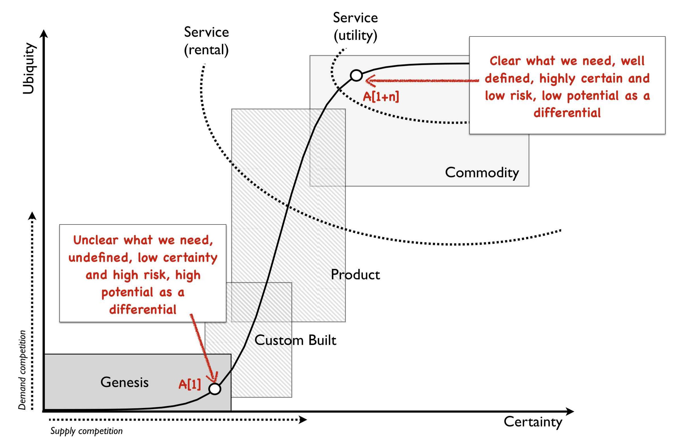

# VM per Service to Kubernetes Migration
[Financial Times - Migrating to Kubernetes - Sarah J Wells -2018](https://www.youtube.com/watch?v=H06qrNmGqyE&t=7s)
- 150 services, one service per VM
- Go, language
- journey : start at home and not sure of the map, the roads or the endpoint.  We had an idea of the city, but we dont' know where it is.  We are also carrying a lot of baggage of decisions we have made in the past.
- don't choose latest technology.   THink of the Gartner Curve (she mentions the [Wardley Map - Predictability of What ](https://medium.com/wardleymaps/anticipation-89692e9b0ced) (see ..Assets)
- Innovation Points: choosing boring technology. Quoting [Esty - McFunley - Choosing Boring Technology](https://mcfunley.com/choose-boring-technology).  *Technology for its own sake is snake oil*.  The idea that innovation has a limited amount of innovation it can sustain (embrace boredom).   An exmaple, is choosing NodeJS is one token, choosing MongoDB another token, using a new service discovery technology another token.  Boring is not bad, boring can be MySQL, Python, PostGres, PHP, Memcached, Squid, Cron (assuming you have technology base established for these).  Boring tech has:
  - established capabilities
  - understood failure modes
  - less unknown unknowns (and a baseline of known unknowns to consider - behaviour at CPU = 100%, ...)
- Example: Adding technology to your company comes with a cost. As an abstract statement this is obvious: if we’re already using Ruby, adding Python to the mix doesn’t feel sensible because the resulting complexity would outweigh Python’s marginal utility.  (see ../Assets for PDF)
- define metrics for success: 1) time spent on support operations, 2) negative sentiment on slack by developers
- ran two stacks in parallel, 2 ci/cd Jenkins-based pipelines
- single GitHub branch with release-tags
- Helm charts and templated Jenkins pipeline
- Helm charts replaced *systemd* for services
- risk-based testing (focus on production)
- boring technology, technology curve
- using popular technology has benefits over building your own, as you are not at risk of people leaving, developers can learn from talks, videos, conferences and talking to other companies
- services, health checks : built tooling to monitor health checks and health of services. *A standard that isn't enforced will not be complied to*
- kubernetes : __gtg - good-to-go : services must accurately respond when available.
- kubernetes : services must be able to recover.   Prior to k8s, their services could have dependencies on a database since it the db-service was not moving.  k8s moves services, and services must be able to recover form these moves.
- wish they had swarmed this project (all devs on hand) - this was tedious and repetitive work for the developers

# Kubernetes Hardening
- [NSA & CISA Kubernetes Hardening Guidance - 2022-03](https://media.defense.gov/2021/Aug/03/2002820425/-1/-1/0/CTR_Kubernetes_Hardening_Guidance_1.1_20220315.PDF):  

# Kubeflow
- [Kubeflow](https://www.kubeflow.org/): The Machine Learning Toolkit for Kubernetes.  The Kubeflow project is dedicated to making deployments of machine learning (ML) workflows on Kubernetes simple, portable and scalable. Our goal is not to recreate other services, but to provide a straightforward way to deploy best-of-breed open-source systems for ML to diverse infrastructures. Anywhere you are running Kubernetes, you should be able to run Kubeflow.

# Kubernetes Terms

See [Kubernetes Concepts](https://kubernetes.io/docs/concepts/)

- Kubernetes - NSA / CISA Definition: Kubernetes is an open source system that automates the deployment, scaling, and management of applications run in containers. Kubernetes clusters are often hosted in a cloud environment, and provide increased flexibility from traditional software platforms.

  Kubernetes is commonly targeted for three reasons: data theft, computational power theft, or denial of service. Data theft is traditionally the primary motivation; however, cyber actors may attempt to use Kubernetes to harness a network’s underlying infrastructure for computational power for purposes such as cryptocurrency mining.

## Sceduling, Peremption and Eviction
In Kubernetes, scheduling refers to making sure that Pods are matched to Nodes so that the kubelet can run them. Preemption is the process of terminating Pods with lower Priority so that Pods with higher Priority can schedule on Nodes. Eviction is the process of terminating one or more Pods on Nodes.

taint and toleration:
- [Node affinity](https://kubernetes.io/docs/concepts/scheduling-eviction/assign-pod-node/#affinity-and-anti-affinity) is a property of Pods that attracts them to a set of nodes (either as a preference or a hard requirement). Taints are the opposite -- they allow a node to repel a set of pods.
- Tolerations are applied to pods, and allow (but do not require) the pods to schedule onto nodes with matching taints.
- Taints and tolerations work together to ensure that pods are not scheduled onto inappropriate nodes. One or more taints are applied to a node; this marks that the node should not accept any pods that do not tolerate the taints.
