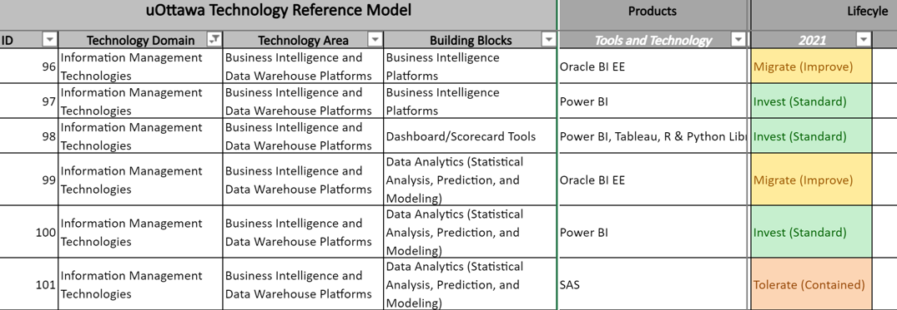

# University of Ottawa EA

UO presented to [EA Community of Practice - TBS-OCIO-Enterprise Architecture]](https://gccollab.ca/profile/eaae) 2021-07.  Guessing about a $100M project budget based on [annual report](https://www.uottawa.ca/ressources-financieres/planification-financiere/sites/www.uottawa.ca.ressources-financieres.planification-financiere/files/fina-200428-001_budget_narrative_bdg_may_05_2020_web_eng_.pdf).   I believe the presentation was part of CANHEIT 2021 (a Canadian Higher Education IT leaders from universities - )

[GCcollab EA Journey at UOttawa](https://gccollab.ca/file/view/9052979/enenterprise-architecture-journey-at-uottawafr) - [UOttawa Presentation](https://gccollab.ca/file/download/9052979)
- See also [OneDrive ..\Technical\Architecture\Enterprise](https://1drv.ms/p/s!AkwXSmFk-_xpgoN5ptJxHxitomeK9w?e=NoAWtD)

Architecture is linked in each domain; both with top-down (business driven) and bottom-up (technical driven).  Traceability of goals in relation to investment and management of PPT (people, process and technology).

Application Lifecycle Activities
1. Value Stream Mapping
1. Capability Domain Mapping
1. Application Rationalization
1. Technology Bricks

# Communicating Investment Guidance.

The EA team will maintain the artifacts; however, the lifecycle and usage of a selected technologies must be maintained by the implicated domain architect.  UOttawa has 8 Technology Domains, 27 Technical Areas, 150 Building Blocks.

1. Technology Bricks : An architecture activity used to identify the lifecycle and recommended usage of the technology building blocks that are represented by the list of technology groupings within the Technology Reference Model.  Technology Bricks are used to help support the architecture activity of Application Rationalization and can serve as a Technology Roadmap.

1. Technology Reference Model : A product and vendor agnostic list of technology domains, technology areas, and technology building blocks that is used to classify current and potential technology investments and uOttawa applications.  This is the most abstract view to classify uOttawa technology investments.

1. Technologies : A list of vendor, open source, or 3rd party technologies that are associated to a technology brick.  The information can be used as the uOttawa Current State Technology Architecture.

1. IT Standards : The list of technologies belonging to a Technology Brick that have the INVEST lifecycle state and endorsed by ARB and provide Faculties, Services and IT teams investment guidance.

Technology Reference Model : {Technology Domain, Technology Area, Building Blocks}
Technology Bricks : {Building Block, Products (Tools and Technology), Lifecycle/Year}

# UOttawa EA Web site
- [UOttawa EA](https://it.uottawa.ca/about/cio-office/enterprise-architecture-strategies)
- [UOttawa POP - Admin Services Modernization Program](www.uottawa.ca/pop/en)

- ERP using Workday and Deloitte as systems integrators.

## People
- IT Director - Daniel Trottier
- [EA - MaryAnn Welke Lesage](https://it.uottawa.ca/news/get-to-know-maryann-welke-lesage)
- CIO - Martin Bernier
- Application Architect - Rajesh Dawar

MaryAnn:  A digital strategist, an enterprise designer and a futurist.

## Technology
Use NJOYN for Recruitment [SaaS NJOYN](https://www.njoyn.com/).   The multi-year [Recruitment Project](https://www.uottawa.ca/pop/en/projects/recruitment) aims to review and improve the recruitment processes for academic and administrative positions by focusing on the: recruiting staff needs; candidates' experience; operating model; Human Resources roles and responsibilities; workforce attraction; standardization and automation of processes while maintaining agility.

# Learning
- Application Reference Model : Reference in uOttawa slide deck.   What is it?  [CIO Wiki - Application Capability Reference Model](https://cio-wiki.org/wiki/Application-Capability_Reference_Model_(ARM))
- UK Gov -
