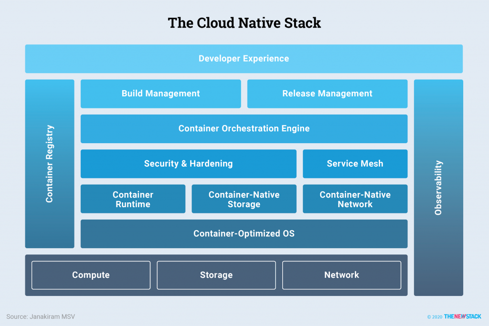

# Cloud Native Stack
Started looking at this as part of Service Mesh which is more-and-more a key compoent of a cloud native stack.

Cloud Management Platform:
- consistent platform: consistent experience in the public cloud and on-premise environments
- DevOps processes: Integration with DevOps practices to ensure rapid service delivery.
- Security: The container management platform must ensure the security of the infrastructure and applications.  This includes detecting vulnerabilities before deploying applications, monitoring the infrastructure for violations.
- Infrastructure reliability:  SLA service delivery model that delivers maximum uptime for infrastructure and platform.
- HA workloads: High-availability of Business applications.
- Observability:  Platform provide insights into the infrastructure, resources and applications (capture and display/alerts/drill-down of metrics, events, logs and traces from entire stack)
- multi-tenancy
- policy-driven management

Cloud Native StackOverflow
[Ref: TheNewStack.io - 2020](https://thenewstack.io/what-is-the-modern-cloud-native-stack/)

.

Components:
- Developer experience
- Build management
- Release management
- Container Orchestration Engine
- Security & Hardening
- Service Mesh
- Container Runtime
- Container Native Storage
- Container Native Network
- Container Optimized OS
- Cross-Cutting:
-- Container Registry
-- Observability
- Compute, Storage, Network

Observability:
Monitoring:  Cloud-native monitoring tools provide real-time telemetry and insight into apps regardless of whether they're single-process monolithic applications or distributed microservice architectures. They include tools that allow collection of data from the app as well as tools for querying and displaying information about the app's health.
